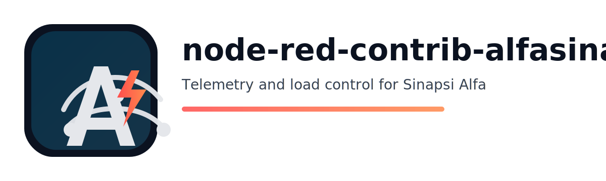

  

[![NPM version][npm-version-image]][npm-url]
[![Node.js version][node-version-image]][npm-url]
[![Node-RED Flow Library][flows-image]][flows-url]
[![Docs][docs-image]][docs-url]
[![NPM downloads per month][npm-downloads-month-image]][npm-url]
[![NPM downloads total][npm-downloads-total-image]][npm-url]
[![MIT License][license-image]][license-url]
[![JavaScript Style Guide][standard-image]][standard-url]
[![Youtube][youtube-image]][youtube-url]

Nodi Node-RED per collegare **Sinapsi Alfa** via WiFi e creare un **controller carichi**.

## Requisiti

- Un dispositivo Sinapsi Alfa raggiungibile sulla tua rete WiFi

## CHANGELOG

[CHANGELOG](changelog.md)

## Avvio rapido (passo-passo)

1. Apri l'editor di Node-RED.
2. Nella palette a sinistra, cerca "alfasinapsi".
3. Trascina **alfasinapsi telemetria** nel flow.
4. Fai doppio click e premi la **matita** vicino a _Dispositivo_ per creare una nuova configurazione **alfasinapsi device**.
5. Compila:
   - **Indirizzo IP Sinapsi**: l'indirizzo IP del tuo Sinapsi Alfa (esempio `192.168.1.186`)
6. Premi **Add**, poi **Done**.
7. Collega l'uscita del nodo telemetria a un nodo **Debug** e premi **Deploy**.

Dovresti vedere i messaggi nella sidebar di debug con valori di potenza ed energia.

  

Esempio `examples/alfasinapsi-load-controller.json`.

## Nodi

### `alfasinapsi-telemetry`

Interroga Sinapsi Alfa e, in base alla configurazione <i>Compatibilita</i>, invia:

- **Telemetria** (default): un messaggio con misure semplificate + dettagli tecnici.
- **KNX Load Control PIN**: un messaggio compatibile con l'ingresso del nodo KNX Load Control (es. `knxUltimateLoadControl`) per forzare shed/unshed.
- **Stato connessione**: quando cambia lo stato del dispositivo, invia un messaggio di stato.

Output:

- Modalita <b>Telemetria</b>:
  - `msg.topic = "alfasinapsi/telemetry"`
  - `msg.payload` (semplificato): potenza/energia (import/export/production), fascia tariffaria, avviso distacco + timestamp
  - `msg.insight` (tecnico): telemetria completa decodificata (include campi extra come fasce di ieri, medie di quarto d'ora, ecc.)
  - `msg.status`: stato connessione corrente
- Modalita <b>KNX Load Control PIN</b> (ogni 10s):
  - `msg.topic = "alfasinapsi/telemetry/knx-load-control-pin"`
  - `msg.payload = "shed" | "unshed"`
  - `msg.shedding = "shed" | "unshed"`
  - `msg.status`: stato connessione corrente
- Messaggio <b>Stato connessione</b> (solo quando cambia):
  - `msg.topic = "alfasinapsi/telemetry/status"`
  - `msg.payload = msg.status`

Configurazione:

- `Dispositivo`: IP del tuo Sinapsi (parametri di connessione fissi per stabilita)
- `Poll (ms)`: ogni quanto il nodo legge i dati
- `Solo se cambia`: se abilitato, emette solo quando cambiano i valori principali
- `Compatibilita`: seleziona <i>Telemetria</i> oppure <i>KNX Load Control PIN</i>
  - Nota: in modalita <i>KNX Load Control PIN</i> emette ogni 10s (il polling interno viene limitato a 10s e <i>Solo se cambia</i> non si applica).

### `alfasinapsi-load-controller`

Legge la telemetria direttamente da Sinapsi Alfa (polling) e decide quali carichi accendere/spegnere.

Uscita 1: riepilogo (`msg.topic = "alfasinapsi/controller"`).  
Uscite 2..N+1: comando ON/OFF per ogni carico (payload booleano).

Algoritmo (configurabile):

- **Surplus**: abilita i carichi quando c'e abbastanza **export** verso rete (W).
- **Limite import**: disabilita i carichi quando **import** supera una soglia (W).
- **Avviso distacco**: se presente, spegne tutto (forzato).

Note:

- I comandi per singolo carico sono `msg.payload = true/false` con `msg.topic = "load/<name>"`.
- Puoi forzare un carico inviando un messaggio in ingresso con `topic = "load/<name>"` e `payload` booleano.

## Dettagli (per utenti inesperti)

### 1) `alfasinapsi-device` (nodo di configurazione)

Questo nodo non appare nel flow come un nodo normale. E' una configurazione condivisa usata dagli altri nodi.

Campo principale:

- **Indirizzo IP Sinapsi**: indirizzo IP o hostname del dispositivo Sinapsi Alfa

Impostazioni fisse (non modificabili):

- Il profilo di connessione e' fisso per stabilita (serve solo l'indirizzo IP).

### 2) `alfasinapsi-telemetry` (misure in sola lettura)

Questo nodo legge le misure ogni _Poll (ms)_ e invia messaggi dal suo unico output.

In piu:

- Ogni messaggio include `msg.status` (stato connessione corrente).
- Quando cambia lo stato di connessione, emette anche un messaggio dedicato con `msg.topic = "alfasinapsi/telemetry/status"`.

Puoi scegliere cosa emettere dall'output con <i>Compatibilita</i>:

- <b>Telemetria</b>: messaggio con misure + dettagli tecnici.
- <b>KNX Load Control PIN</b>: messaggio `shed/unshed` ogni 10 secondi (compatibile con il nodo KNX Load Control).
  - Nota: in questa modalita <i>Solo se cambia</i> non si applica e il polling interno viene limitato a 10s (anche se imposti un Poll piu alto).

Uso tipico:

- Collegalo a un nodo **Debug** per vedere i valori.
- Collegalo a una **Dashboard** (o alla tua logica) per visualizzare o usare potenza/energia.

Struttura del messaggio (modalita <b>Telemetria</b>):

- `msg.payload` - campi semplificati per l'uso quotidiano:
  - `payload.power.importkW` / `exportkW` / `productionkW`
  - `payload.energy.importTotalkWh` / `exportTotalkWh` / `productionTotalkWh`
  - `payload.tariffBand`
  - `payload.cutoff.hasWarning` / `payload.cutoff.remainingSeconds` / `payload.cutoff.atIso`
  - `payload.messageAtIso` / `payload.meterReadAtIso`
- `msg.insight` - dettagli tecnici:
  - `insight.telemetry`: telemetria completa decodificata (include campi extra come fasce di ieri, medie di quarto d'ora, ecc.)
  - `insight.meta`: timestamp, modalita di lettura
  - `insight.device`: dettagli del profilo di connessione
- `msg.status` - stato connessione:
  - `status.connected` (boolean)
  - `status.connecting` (boolean)
  - `status.error` (string|null)
  - `status.ts` (number, epoch ms)

Struttura del messaggio (modalita <b>KNX Load Control PIN</b>):

- `msg.payload = "shed"` se e' presente un avviso distacco imminente, altrimenti `msg.payload = "unshed"` (ogni 10s)
- `msg.shedding` con lo stesso valore (per compatibilita con KNX Load Control)

## Terminologia (import/export/surplus)

Questi sono termini standard nel monitoraggio energetico:

- **Import**: potenza/energia prelevata dalla rete (stai consumando piu di quanto produci).
- **Export**: potenza/energia immessa in rete (stai producendo piu di quanto consumi).
- **Surplus**: potenza in eccesso disponibile. In questo pacchetto la logica surplus si basa su **export** (eventualmente ridotto da _Surplus reserve_).

### 3) `alfasinapsi-load-controller` (solo decisioni)

Questo nodo legge la telemetria (fa polling in autonomia) e invia:

- Uscita 1: un **riepilogo** della potenza attuale e dello stato del controller
- Uscite 2..N+1: un comando booleano per ogni carico configurato

Importante: questo nodo **non comanda i relè da solo**. Devi collegare ogni uscita carico a qualcosa che accende/spegne davvero i dispositivi (per esempio MQTT, nodi Shelly, chiamate di servizio Home Assistant, ecc.).

Come configurare i carichi:

- **Nome**: usato come etichetta di uscita e per l'override manuale (`load/<name>`)
- **W**: consumo atteso del carico (serve a stimare quanti carichi possono rientrare nel surplus disponibile)
- **Priorita**: numero piu basso = priorita piu alta (tenuto ON piu a lungo)
- **Min acceso (s)**: tempo minimo in cui il carico resta acceso prima di poter essere spento
- **Min spento (s)**: tempo minimo in cui il carico resta spento prima di poter essere acceso

Override manuale (opzionale):

Invia un messaggio all'ingresso del nodo:

- `msg.topic = "load/<name>"`
- `msg.payload = true` (force desired ON) or `false` (force desired OFF)

## Problemi di connessione? Ricorda

- Sinapsi Alfa in genere accetta una sola connessione alla volta: evita di collegare piu sistemi contemporaneamente.

[npm-version-image]: https://img.shields.io/npm/v/node-red-contrib-alfasinapsi-ultimate.svg
[npm-url]: https://www.npmjs.com/package/node-red-contrib-alfasinapsi-ultimate
[node-version-image]: https://img.shields.io/node/v/node-red-contrib-alfasinapsi-ultimate.svg
[flows-image]: https://img.shields.io/badge/Node--RED-Flow%20Library-red
[flows-url]: https://flows.nodered.org/node/node-red-contrib-alfasinapsi-ultimate
[docs-image]: https://img.shields.io/badge/docs-documents-blue
[docs-url]: documents/
[npm-downloads-month-image]: https://img.shields.io/npm/dm/node-red-contrib-alfasinapsi-ultimate.svg
[npm-downloads-total-image]: https://img.shields.io/npm/dt/node-red-contrib-alfasinapsi-ultimate.svg
[license-image]: https://img.shields.io/badge/license-MIT-green.svg
[license-url]: https://opensource.org/licenses/MIT
[standard-image]: https://img.shields.io/badge/code%20style-standard-brightgreen.svg
[standard-url]: https://standardjs.com
[youtube-image]: https://img.shields.io/badge/YouTube-Subscribe-red?logo=youtube&logoColor=white
[youtube-url]: https://www.youtube.com/@Supergiovane
